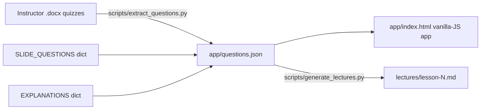

# BGU Music Exam Prep — Ben Gurion University Classical Music Course Practice


Open-source study aid for the Ben Gurion University (BGU) orchestral-music course **חוויה מוזיקלית — שומעים שזה קלאסי**. Hebrew multiple-choice questions drawn from the instructor's quizzes and the lecture slides, paired with a web app (practice, exam, weak-spot drill) and a full per-lecture question index you can read straight on GitHub.

**Keywords:** BGU music, Ben Gurion University music, music BGU, חוויה מוזיקלית, שומעים שזה קלאסי, classical music, orchestra, exam prep, Hebrew quiz, music education Israel.

## About the course

"חוויה מוזיקלית — שומעים שזה קלאסי" is an orchestral-music survey course at Ben Gurion University of the Negev (BGU). The six lessons cover:

1. The orchestra — families, roles, history
2. Genres and forms — sonata, rondo, ABA, overture, concerto
3. Strings — construction, technique, Bach, Mozart
4. Winds and percussion — reed families, brass, pitched vs. unpitched
5. Piano as soloist — evolution from harpsichord, concerto, Romantic virtuosity
6. The human voice and opera — choir, aria, recitative, Verdi, Puccini

## Features

- 75 multiple-choice questions in Hebrew, covering all six lessons
- Three modes: free practice with instant feedback, 20-question timed exam, weak-spot drill (wrong-answer-weighted sampling)
- 1–2 sentence explanation for every answer, in Hebrew
- Per-lecture Q&A pages you can read straight on GitHub
- Zero build step, zero dependencies — stdlib Python extractor and vanilla JS/HTML
- Runs fully offline; progress persists locally in your browser

## Quickstart

```bash
git clone https://github.com/terminator1333/bgu-music-exam-prep.git
cd bgu-music-exam-prep
python3 -m http.server 8000 --directory app
# open http://localhost:8000
```

`file://` won't work — the app uses `fetch()` to load the question bank, so you need an HTTP server.

## Browse the questions

- [שיעור 1 — היכרות עם התזמורת](lectures/lesson-1.md)
- [שיעור 2 — סוגות וצורות](lectures/lesson-2.md)
- [שיעור 3 — כלי המיתר](lectures/lesson-3.md)
- [שיעור 4 — כלי נשיפה והקשה](lectures/lesson-4.md)
- [שיעור 5 — הפסנתר כסולן בתזמורת](lectures/lesson-5.md)
- [שיעור 6 — הקול האנושי והאופרה](lectures/lesson-6.md)

Each page shows every question from that lesson with the correct option bolded and a short Hebrew explanation underneath.

## Architecture



Three pieces: a stdlib Python extractor that reads the `.docx` quiz files, a generated `questions.json`, and a single-page vanilla-JS app that consumes it. A second small script renders the same JSON as per-lesson Markdown for the browse view.

## Regenerating content

```bash
# rebuild questions.json from the .docx sources + EXPLANATIONS dict
python3 scripts/extract_questions.py

# rebuild lectures/*.md from questions.json
python3 scripts/generate_lectures.py
```

## Contributing / reporting mistakes

Found a wrong answer, typo, or weak explanation? Open an issue or a pull request.

- For answer keys or parsing fixes, edit `scripts/extract_questions.py` and re-run it.
- For explanations, edit the `EXPLANATIONS` dict at the top of `scripts/extract_questions.py`.
- For ad-hoc tweaks, `app/questions.json` can be edited directly — but note that re-running the extractor overwrites it.

## Disclaimer

This is an unofficial, community-maintained study aid. It is **not** affiliated with, endorsed by, or representative of Ben Gurion University (BGU), the course staff, or the original course authors. Question content is paraphrased from publicly shared course materials; the original copyright remains with the original authors. No guarantee of accuracy, completeness, or exam performance is provided. Use at your own risk. Provided "as-is" with no warranty. Please report errors or omissions via GitHub issues.

## License

Code: MIT (see [LICENSE](LICENSE)). Question text is derived from the course's shared materials; original copyright remains with the course authors.
